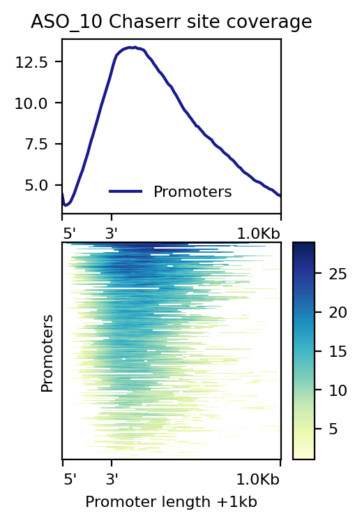

# chaserr-human-mouse

## 2.1. Гомологи

## 2.2. Профили взаимодействия (human)

Ссылка на [colab ноутбук](https://colab.research.google.com/drive/1wVug5xCxIxlLOYn_ZnoqmVdEtorR4Pvi?usp=sharing).

## 2.3. Профили взаимодействия (mouse)

### Входные данные

- [data/chaserr_human.fna](data/chaserr_human.fna) -- последовательность Chaserr из статьи
- [data/ASO_G0272888_AD_07.chaserr_human.mix.assa](data/ASO_G0272888_AD_07.chaserr_human.mix.assa) (6,518)
- [data/ASO_G0272888_AD_07.chaserr_human.mix.sites](data/ASO_G0272888_AD_07.chaserr_human.mix.sites) (177,417)
- [data/ASO_G0272888_AD_10.chaserr_human.mix.assa](data/ASO_G0272888_AD_10.chaserr_human.mix.assa) (4,204)
- [data/ASO_G0272888_AD_10.chaserr_human.mix.sites](data/ASO_G0272888_AD_10.chaserr_human.mix.sites) (115,214)

## 3. Общие регионы взаимодействия для человека

Ссылка на [colab ноутбук](https://colab.research.google.com/drive/1E3zFJ8qXbL-afAKd6N00CZPuBDCJs2y9?usp=sharing).

### Входные данные

- Результаты ASSA для человека
    - ENST00000556895.T0
    - [article_assa_and_f6/data/ASO_G0272888_AD_07/mix.assa](https://github.com/vanya-antonov/article_assa_and_f6/blob/master/data/ASO_G0272888_AD_07/mix.assa) (6,518)
    - [article_assa_and_f6/data/ASO_G0272888_AD_07/mix.sites](https://github.com/vanya-antonov/article_assa_and_f6/blob/master/data/ASO_G0272888_AD_07/mix.sites) (167,580)
    - [article_assa_and_f6/data/ASO_G0272888_AD_07/HGD.red_balls](https://github.com/vanya-antonov/article_assa_and_f6/blob/master/data/ASO_G0272888_AD_07/HGD.red_balls) (3,258)
    - [article_assa_and_f6/data/ASO_G0272888_AD_10/mix.assa](https://github.com/vanya-antonov/article_assa_and_f6/blob/master/data/ASO_G0272888_AD_10/mix.assa) (4,204)
    - [article_assa_and_f6/data/ASO_G0272888_AD_10/mix.sites](https://github.com/vanya-antonov/article_assa_and_f6/blob/master/data/ASO_G0272888_AD_10/mix.sites) (108,817)
    - [article_assa_and_f6/data/ASO_G0272888_AD_10/HGD.red_balls](https://github.com/vanya-antonov/article_assa_and_f6/blob/master/data/ASO_G0272888_AD_10/HGD.red_balls) (2,102)
- Результаты ASSA для мыши
    - ToDo

### Результаты

| ASO_07 | ASO_10 |
|:---:|:---:|
|||

## 5. Взаимодействие Chaserr с другими хеликазами

Ссылка на [colab ноутбук](https://colab.research.google.com/drive/1M5hKI0m_XLca6Cqx5VmaWthlnnRgQwbJ?usp=sharing).

### Входные данные

- [19 ChIP-seq экспериментов](https://www.encodeproject.org/search/?type=Experiment&replicates.library.biosample.donor.organism.scientific_name=Homo+sapiens&assay_title=TF+ChIP-seq&status=released&biosample_ontology.classification=cell+line&target.label=CHD2&target.label=CHD1&target.label=CHD4&target.label=CHD7&assembly=GRCh38&files.file_type=bed+narrowPeak) из ENCODE (hg38)
- Данные по экспрессии для промотеров
    - [data/ASO_G0272888_AD_07.oligo_DE_Summary_promoter.tsv](data/ASO_G0272888_AD_07.oligo_DE_Summary_promoter.tsv) (27,441)
    - [data/ASO_G0272888_AD_10.oligo_DE_Summary_promoter.tsv](data/ASO_G0272888_AD_10.oligo_DE_Summary_promoter.tsv) (28,123)
- Данные по таргетным промотерам
    - [article_assa_and_f6/blob/master/data/ASO_G0272888_AD_07.DE_Summary](https://github.com/vanya-antonov/article_assa_and_f6/blob/master/data/ASO_G0272888_AD_07.DE_Summary) (3,259)
    - [article_assa_and_f6/blob/master/data/ASO_G0272888_AD_10.DE_Summary](https://github.com/vanya-antonov/article_assa_and_f6/blob/master/data/ASO_G0272888_AD_10.DE_Summary) (2,102)

### Результаты

