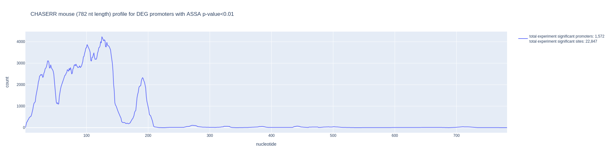
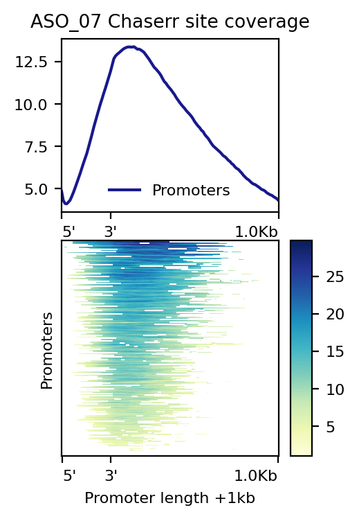
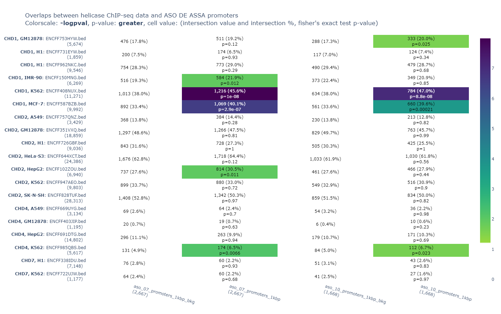
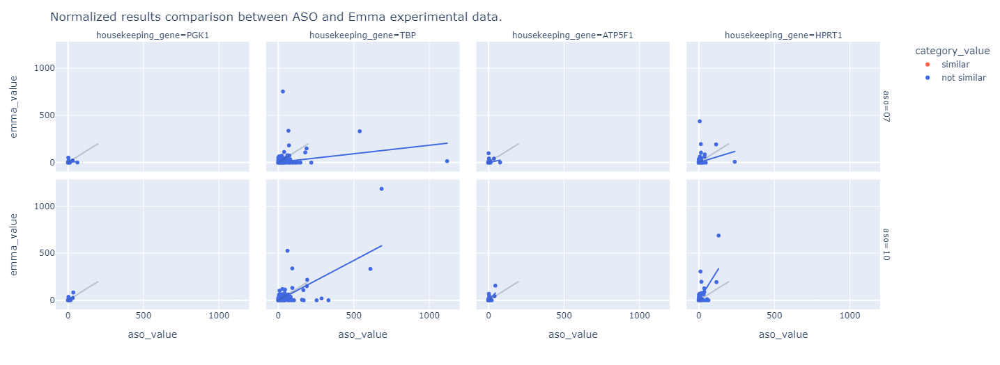

# Для отчета

## 4.1.1. Должен быть подготовлен список генов мыши, с которыми потенциально может связываться нкРНК Chaserr с помощью разработанной в лаборатории программы предсказания РНК-РНК взаимодействий ASSA.

**Было получено [1,572 уникальных генов](output/single_deg_promoters_significant.gene_id_list)** (entrezgene id):


* Взяли результаты мышиного RNA-seq Улицкого (табличка [data/0923.xlsx](data/0923.xlsx), столбец "mEF Chaserr-/-"). Общее кол-во ДЕ-генов (adj_pvalue < 0.05) было 2,556 ([output/DEgene_ids_list.txt](output/DEgene_ids_list.txt)).

* Для этих генов были получены все транскрипты по аннотации FANTOM5 (2,448 ДЕ-генов имели хотя бы один транскрипт -- [output/DEgene_ids_list_promoter.txt](output/DEgene_ids_list_promoter.txt)) -- **тут используется версия генома mm9**, тк нет аннотации FANTOM для mm10.

* Для каждого из 2,448 генов взяли все промотеры (общее кол-во  промотеров  10,725 -- [output/DEgene_promoter_list.txt](output/DEgene_promoter_list.txt)) и к каждому промотеру добавили +1kb downstream и получили их геномные посл-ти (длина этих посл-тей будет от 1кб до 1.2 кб -- [output/mm9_deg_promoters_1kbp.fa](output/mm9_deg_promoters_1kbp.fa)) -- **из генома mm9**!

* Запускаем ASSA для Chaserr-mouse (ENSMUST00000184554.8) против 10,725 посл-тей, полученных выше.

* Для каждого гена выбрали один промотер с самым сильным p-value ASSA (получился 2,448 промотера -- [output/single_deg_promoters.tsv](output/single_deg_promoters.tsv))

* И из этого списка 2,448 промотеров были выбраны 1,572 случаев, где ASSA p-value < 0.01. Это и есть список генов мыши, с которыми потенциально может связываться нкРНК Chaserr -- [output/single_deg_promoters_significant.tsv](output/single_deg_promoters_significant.tsv).

## 4.1.2. Должен быть выполнен подробный анализ предсказанных участков связывания нкРНК Chaserr человека и ее мышиного гомолога, в частности должен быть построен профиль частоты взаимодействия Chaserr с таргетными транскриптами (для человека и мыши)

Человек:


Мышь:


## 4.1.3. Должны быть  выделены общие для большинства таргетных генов нкРНК Chaserr регионы взаимодействия (для человека и мыши)

<!-- **ПЕРЕИМЕНОВАТЬ TSS в "promoter start", TES => "TSS"** -->

<!--  -->

| human ASO_07 | human ASO_10 | mouse RNA-seq |
|:---:|:---:|:---:|
||||

## 4.1.4. Должен быть проведен анализ обогащения GO и регуляторными путями набора таргетных генов нкРНК Chaserr (отдельно для мыши и человека).
Человек - https://github.com/vanya-antonov/article_assa_and_f6/blob/master/data/2_pvalues.co.txt

Списки генов (названия генов в столбик):
* Человек ASO-7 -- есть 2667 ДЕ-промотеров + ASSA (пересечение HGD.drawn_balls и HGD.red_balls) =>  2,202 уникальных генов - [output/ASO_07_gene_symbols_list.txt](output/ASO_07_gene_symbols_list.txt)
* Человек ASO-10 -- есть 1668 ДЕ-промотеров + ASSA (пересечение HGD.drawn_balls и HGD.red_balls) => 1,424 уникальных генов - [output/ASO_10_gene_symbols_list.txt](output/ASO_10_gene_symbols_list.txt) 
* Мышь RNA-seq 1,572 уникальных генов - [output/DEgene_ids_list.txt](output/DEgene_ids_list.txt)

Результаты GO анализа полученные с помощью веб-сервиса PANTHER DB:
* [Human ASO-7 molecular function](https://github.com/vanya-antonov/chaserr-human-mouse/blob/main/data/GO_molecular_function.ASO_07.txt)
* [Human ASO-10 molecular function](https://github.com/vanya-antonov/chaserr-human-mouse/blob/main/data/GO_molecular_function.ASO_10.txt)
* [Mouse RNA-seq molecular function](https://github.com/vanya-antonov/chaserr-human-mouse/blob/main/data/GO_molecular_function.mouse_RNA_seq.txt)

## 4.1.5. Должна протестирована возможность взаимодействия Chaserr с другими хеликазами, для этого с использованием публичных данных ChIP-seq должен быть проведен анализ ко-локализации потенциально таргетных участков с участками локализации других хеликаз



## 4.1.7 Должно быть проведено сравнение данных экспрессии генов в фибробластах пациентки с гетерозиготной делецией Chaserr с полученными ранее данными по подавлению Chaserr с помощью антисмысловых олигонуклеотидов с использованием методов, основанных на ранговых статистиках, разработанных участниками коллектива

Ссылка на ноутбук: https://colab.research.google.com/drive/1cO23CeYcqDfKFJPCnACFPebNBAUuASnA?usp=sharing.

Count-матрица и промежуточные результаты лежат в http://himorna.fbras.ru/~fed/rnaseq_results/.

Корреляция Пирсена между экспериментами FANTOM6 и Emma для наборов DE-генов с высокой значимостью ASSA:

- ASO 07: correlation=0.25, pvalue=2.7-33
- ASO 10: correlation=0.69, pvalue=1.4-206



```bash
# download HISAT2 indexes
$ wget https://genome-idx.s3.amazonaws.com/hisat/hg38_genome.tar.gz
$ tar -zxvf hg38_genome.tar.gz
$ rm hg38_genome.tar.gz

# run fastqc
$ mkdir fastqc
$ fastqc --quiet -o fastqc /data/CHASERR/data/private/rna_seq_Emma/UDN809320_S.1.fastq
$ fastqc --quiet /data/CHASERR/data/private/rna_seq_Emma/UDN809320_S.2.fastq

# run hisat2
$ mkdir hisat
$ hisat2 -p 8 -x hg38/genome -1 /data/CHASERR/data/private/rna_seq_Emma/UDN809320_S.1.fastq -2 /data/CHASERR/data/private/rna_seq_Emma/UDN809320_S.2.fastq -S hisat/UDN809320_S.sam --summary-file hisat/UDN809320_S.sam.summary
$ samtools sort -n hisat/UDN809320_S.sam > hisat/UDN809320_S.sorted.sam

# run htseq
$ mkdir htseq
$ htseq-count --quiet -r name --stranded=no hisat/UDN809320_S.sorted.sam /home/ymedvedeva/FANTOM6/data/private/F6_CAT.transcript.gtf > htseq/UDN809320_S.counts
$ grep '^__' htseq/UDN809320_S.counts > htseq/UDN809320_S.counts.info
```

# Детали работы

## 2.1. Ортологи

Ссылка на [colab ноутбук](https://colab.research.google.com/drive/1JS8iUqV0oUH4CZuBMXifwLFpeBQ_pJkW?usp=sharing).

## 2.2. Профили взаимодействия (human)

Ссылка на [colab ноутбук](https://colab.research.google.com/drive/1wVug5xCxIxlLOYn_ZnoqmVdEtorR4Pvi?usp=sharing).

### Входные данные

- [data/chaserr_human.fna](data/chaserr_human.fna) -- последовательность CHASERR из статьи
- [data/ASO_G0272888_AD_07.chaserr_human.mix.assa](data/ASO_G0272888_AD_07.chaserr_human.mix.assa) (6,518)
- [data/ASO_G0272888_AD_07.chaserr_human.mix.sites](data/ASO_G0272888_AD_07.chaserr_human.mix.sites) (177,417)
- [data/ASO_G0272888_AD_10.chaserr_human.mix.assa](data/ASO_G0272888_AD_10.chaserr_human.mix.assa) (4,204)
- [data/ASO_G0272888_AD_10.chaserr_human.mix.sites](data/ASO_G0272888_AD_10.chaserr_human.mix.sites) (115,214)

### Результат


## 2.3. Профили взаимодействия (mouse)

Ссылка на [colab ноутбук](https://colab.research.google.com/drive/10eXPl9n7Zq4NoPhgvpcJpXsnI8SSz1wL?usp=sharing).

### Входные данные

- [data/mm9_chaserr.fna](data/mm9_chaserr.fna) - ENSMUST00000184554.8 Chaserr
- [data/0923.xlsx](data/0923.xlsx) - результаты DE-анализа
- [mm9.cage_peak_phase1and2combined_ann.txt.gz](https://fantom.gsc.riken.jp/5/datafiles/latest/extra/CAGE_peaks/mm9.cage_peak_phase1and2combined_ann.txt.gz) - Fantom promoter data (mm9)

### Результаты

- [chaserr_deg_promoters_1kbp.assa](http://himorna.fbras.ru/~fed/assa_results/chaserr_deg_promoters_1kbp.assa) (10,725)
- [chaserr_deg_promoters_1kbp.all_sites.assa](http://himorna.fbras.ru/~fed/assa_results/chaserr_deg_promoters_1kbp.all_sites.assa) (93,546)
- [output/single_deg_promoters.tsv](output/single_deg_promoters.tsv) (2,448) - список промотеров
- [output/single_deg_promoters_significant.tsv](output/single_deg_promoters_significant.tsv) (1,572) - список значимых промотеров


## 3. Общие регионы взаимодействия для человека

Ссылка на [colab ноутбук](https://colab.research.google.com/drive/1E3zFJ8qXbL-afAKd6N00CZPuBDCJs2y9?usp=sharing).

### Входные данные

- Данные для человека
  - ENST00000556895.T0
  - [article_assa_and_f6/data/ASO_G0272888_AD_07/mix.assa](https://github.com/vanya-antonov/article_assa_and_f6/blob/master/data/ASO_G0272888_AD_07/mix.assa) (6,518)
  - [article_assa_and_f6/data/ASO_G0272888_AD_07/mix.sites](https://github.com/vanya-antonov/article_assa_and_f6/blob/master/data/ASO_G0272888_AD_07/mix.sites) (167,580)
  - [article_assa_and_f6/data/ASO_G0272888_AD_07/HGD.red_balls](https://github.com/vanya-antonov/article_assa_and_f6/blob/master/data/ASO_G0272888_AD_07/HGD.red_balls) (3,258)
  - [article_assa_and_f6/data/ASO_G0272888_AD_10/mix.assa](https://github.com/vanya-antonov/article_assa_and_f6/blob/master/data/ASO_G0272888_AD_10/mix.assa) (4,204)
  - [article_assa_and_f6/data/ASO_G0272888_AD_10/mix.sites](https://github.com/vanya-antonov/article_assa_and_f6/blob/master/data/ASO_G0272888_AD_10/mix.sites) (108,817)
  - [article_assa_and_f6/data/ASO_G0272888_AD_10/HGD.red_balls](https://github.com/vanya-antonov/article_assa_and_f6/blob/master/data/ASO_G0272888_AD_10/HGD.red_balls) (2,102)
- Данные для мыши
  - [data/mm9_chaserr.fna](data/mm9_chaserr.fna) - ENSMUST00000184554.8 Chaserr
  - [chaserr_deg_promoters_1kbp.assa](http://himorna.fbras.ru/~fed/assa_results/chaserr_deg_promoters_1kbp.assa) (10,725)
  - [chaserr_deg_promoters_1kbp.all_sites.assa](http://himorna.fbras.ru/~fed/assa_results/chaserr_deg_promoters_1kbp.all_sites.assa) (93,546)
  - [output/single_deg_promoters_significant.tsv](output/single_deg_promoters_significant.tsv) (1,572)


### Результаты

Для случая `mouse RNA-seq` не учитывается 179 (11.4%) коротких промотеров (длина меньше 10).

| human ASO_07 | human ASO_10 | mouse RNA-seq |
|:---:|:---:|:---:|
||||

## 5. Взаимодействие Chaserr с другими хеликазами

Ссылка на [colab ноутбук](https://colab.research.google.com/drive/1M5hKI0m_XLca6Cqx5VmaWthlnnRgQwbJ?usp=sharing).

### Входные данные

- [19 ChIP-seq экспериментов](https://www.encodeproject.org/search/?type=Experiment&replicates.library.biosample.donor.organism.scientific_name=Homo+sapiens&assay_title=TF+ChIP-seq&status=released&biosample_ontology.classification=cell+line&target.label=CHD2&target.label=CHD1&target.label=CHD4&target.label=CHD7&assembly=GRCh38&files.file_type=bed+narrowPeak) из ENCODE (hg38)
- Данные по экспрессии для промотеров
    - [data/ASO_G0272888_AD_07.oligo_DE_Summary_promoter.tsv](data/ASO_G0272888_AD_07.oligo_DE_Summary_promoter.tsv) (27,441)
    - [data/ASO_G0272888_AD_10.oligo_DE_Summary_promoter.tsv](data/ASO_G0272888_AD_10.oligo_DE_Summary_promoter.tsv) (28,123)
- Данные по таргетным промотерам
    - [article_assa_and_f6/blob/master/data/ASO_G0272888_AD_07.DE_Summary](https://github.com/vanya-antonov/article_assa_and_f6/blob/master/data/ASO_G0272888_AD_07.DE_Summary) (3,259)
    - [article_assa_and_f6/blob/master/data/ASO_G0272888_AD_07/HGD.drawn_balls](https://github.com/vanya-antonov/article_assa_and_f6/raw/master/data/ASO_G0272888_AD_07/HGD.drawn_balls) (4,686)
    - [article_assa_and_f6/blob/master/data/ASO_G0272888_AD_10.DE_Summary](https://github.com/vanya-antonov/article_assa_and_f6/blob/master/data/ASO_G0272888_AD_10.DE_Summary) (2,102)
    - [article_assa_and_f6/blob/master/data/ASO_G0272888_AD_10/HGD.drawn_balls](https://github.com/vanya-antonov/article_assa_and_f6/raw/master/data/ASO_G0272888_AD_10/HGD.drawn_balls) (2,989)

### Результат


